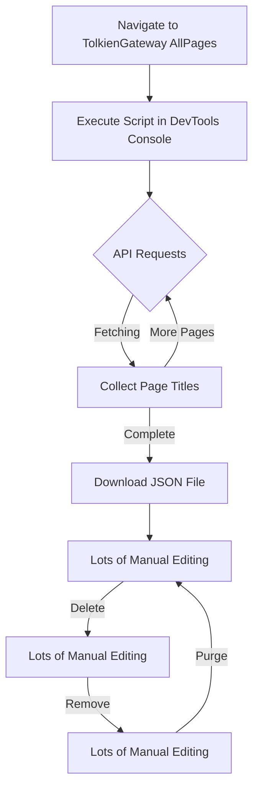

# Tolkien Gateway Download Process

The data from Tolkien Gateway are stored in `data/external-sources/tolkien_gateway_pages.txt`. To replicate this data, follow the steps below:

## Workflow


## Downloading the Data
Downloading this content currently requires a manual process.

1. Navigate to [https://tolkiengateway.net/w/index.php?title=Special:AllPages](https://tolkiengateway.net/w/index.php?title=Special:AllPages) in Chrome
2. Open Chrome dev tools
3. Open Console
4. Copy and paste the following into the console (see [gateway_download.js](gateway_download.js) for standalone version) and hit enter:

  ```js
  async function getAllPages(apiUrl = '/w/api.php') {
    let allPages = [];
    let apcontinue = '';
    
    while (true) {
      const params = {
        action: 'query',
        list: 'allpages',
        aplimit: 500, // Get maximum number of pages per request
        format: 'json',
        origin: '*',
        ...(apcontinue ? { apcontinue } : {})
      };

      const queryString = Object.entries(params)
        .map(([key, value]) => `${key}=${encodeURIComponent(value)}`)
        .join('&');

      const url = `${apiUrl}?${queryString}`;

      try {
        const response = await fetch(url);
        const data = await response.json();
        
        // Add the current batch of pages
        const pages = data.query.allpages.map(page => page.title);
        allPages = allPages.concat(pages);

        // Check if there are more pages to fetch
        if (data.continue && data.continue.apcontinue) {
          apcontinue = data.continue.apcontinue;
          console.log(`Fetched ${allPages.length} pages so far...`);
        } else {
          break; // No more pages to fetch
        }

        // Optional: Add a small delay to avoid hitting rate limits
        await new Promise(resolve => setTimeout(resolve, 100));

      } catch (error) {
        console.error('Error fetching pages:', error);
        break;
      }
    }

    console.log(`Completed! Total pages fetched: ${allPages.length}`);
    return allPages;
  }

  // Optional: Function to save the results to a file (if running in Node.js)
  async function saveToFile(pages, filename = 'all_pages.json') {
    const fs = require('fs').promises;
    await fs.writeFile(filename, JSON.stringify(pages, null, 2));
    console.log(`Saved ${pages.length} pages to ${filename}`);
  }


  window.wikiPages = null;
  getAllPages('https://tolkiengateway.net/w/api.php').then(pages => {
      window.wikiPages = pages;
      console.log('Pages stored in window.wikiPages');
  });

  const blob = new Blob([JSON.stringify(wikiPages, null, 2)], {type: 'application/json'});
  const url = URL.createObjectURL(blob);
  const a = document.createElement('a');
  a.href = url;
  a.download = 'wiki_pages.json';
  a.click();
  ```

5. File will be saved to your file system (example: [wiki_pages.json](wiki_pages.json))
6. This generates nearly 18k entries, which will need to be manually cleaned.  I leave to the user their own methods for doing this.
